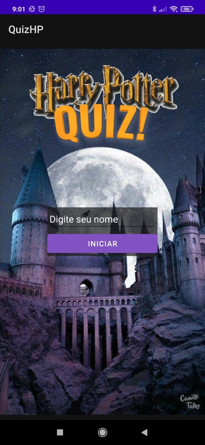
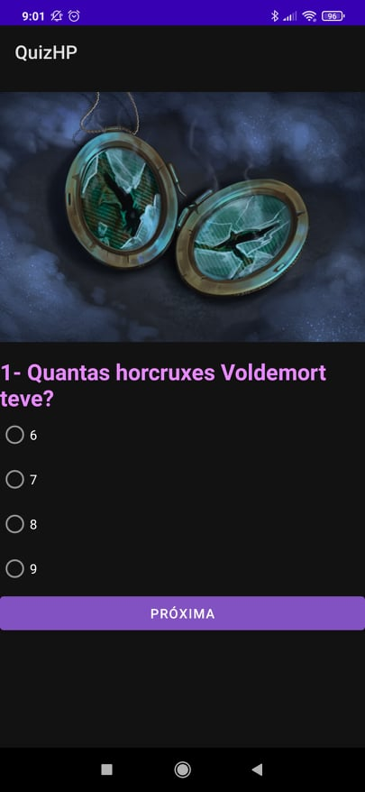
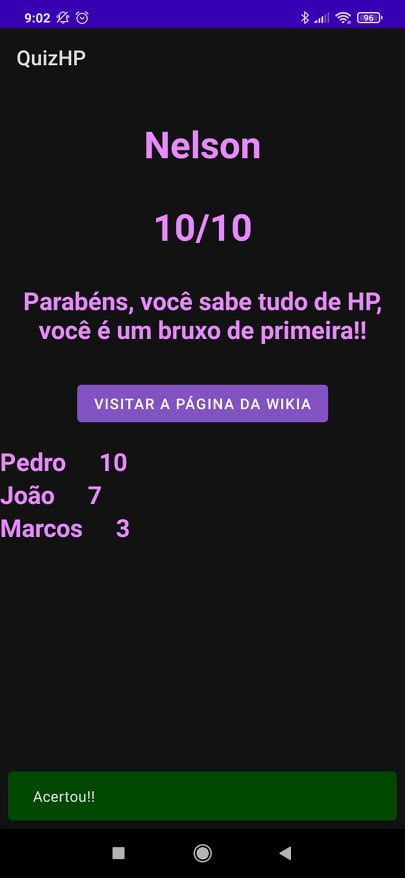

# Fundamentos-do-Desenvolvimento-Android-QuizHP

Chegou a hora de avaliar os conhecimentos adquiridos na disciplina!

Neste Assessment, você desenvolverá um aplicativo à sua escolha, que atenda aos seguintes requisitos:

Deve ser escrito em Kotlin.
Deve apresentar no mínimo 3 telas.
Deve utilizar ao menos 1 intent implícita.
Ao menos uma Activity deve apresentar 2 ou mais fragmentos. Dependendo do seu aplicativo, você pode escolher apresentá-los ao mesmo tempo dividindo a área da tela ou fazer com que um substitua o outro durante a execução do app - aquilo que fizer mais sentido pro uso.
Deve utilizar pelo menos 1 ViewModel e pelo menos uma variável LiveData com observador(es) para atualizar a interface de usuário.
Deve exibir pelo menos uma lista de elementos com uma RecyclerView.
Obs:

Você não precisa apresentar 3 Activities, pode utilizar fragmentos para representar telas diferentes, se quiser e julgar apropriado.
A forma da RecyclerView é livre. Pode ser uma lista ou grid vertical ou horizontal. A sua lista não precisa ser interativa, nem construída pelo usuário, você pode criar dados fictícios diretamente no código. O importante para o momento é saber exibir uma lista usando a RecyclerView.
A proposta e o tema do aplicativo é livre, mas deve atender aos requisitos acima. Aplique todas as boas práticas de desenvolvimento Android ensinadas no curso.
Há várias ideias comuns de aplicativos que podem ser adaptadas para atender aos requisitos. Por exemplo, pode-se fazer um jogo da velha da seguinte forma:

Tela 1: Exibição de uma imagem com o nome do jogo, um botão de "Iniciar jogo" e outro botão de "Créditos".
Tela 2: Um fragmento na parte superior da tela com o tabuleiro onde ocorre o jogo em si; um fragmento na parte inferior com informações acessórias como quem é o próximo a jogar, pontuação etc.
Tela 3: Após o término do jogo, exibe-se uma lista fictícia de pontuações de jogadores, com um botão para o usuário enviar sua própria pontuação por email ou mensagem.
Vários outros jogos clássicos como jogo da forca, jogo da memória, caça palavras etc podem ser adaptados a este modelo. Outros exemplos de aplicativos que podem facilmente atender aos requisitos:

Lista de tarefas/compras
Controle de despesas e receitas
Diário pessoal
Quiz (perguntas com múltipla escolha)
Enquetes/votações
Parte de um e-commerce (seleção de produtos e carrinho de compras)
Antes de iniciar o Assessment, leia toda a especificação e detalhes de entrega. Enquanto estiver programando, teste bastante. Testar bem é uma das mais poderosas e benéficas práticas em programação.
